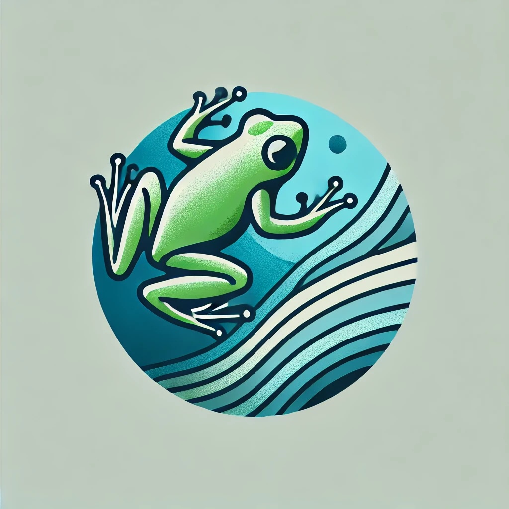

---

## FAIRLeap: FAIR publishing in the geosciences

### February 11-14, 2025, Virtual, Anywhere on Earth
The geosciences are entering an exciting phase, with open-source research ecosystems opening new avenues of investigation. With this great power comes great responsibility: sharing research data, software, and worflow is fundamental to building a Findable, Accessible, Interoperable, and Reusable (FAIR) open science ecocystem. [FROGS](http://linked.earth/FROGS/about) is a new initiative from [LinkedEarth](http://linked.earth) that links together science practice and publishing in a series of synchronous and asynchronous trainings. 

Our second training opportunity (FAIRLeap) kick off **February 11-14th 2025 virtually** and will focus on publishing all artifacts of research in a manner consistent with FAIR principles to ensure that science is reproducible.

* *Intended audience:* researchers already engaged in geoscience research. Participants will be required to have worked through a geoscience project, either as part of a class project, a reproducibility study, or for a manuscript of their own. For manuscript that are still *in preparation*, you must be ready to submit within seven weeks of the workshop. 
* *Learning objectives:* Introduction to FAIR science publishing;  basics of GitHub for software and project management; use of *Docker*, *Binder*, and *myBinder* for the sharing of reproducible workflows. 
* *Description:* The workshop will consist of a blend of lectures and directed homework in the morning synchronous sessions that will be held on Zoom. All lectures will be recorded and made available through YouTube for asynchronous learning. Asynchronous sessions, coordinated through Slack, will be reserved for participant's own research needs. Participants will be expected to present the outcome of the workshop on the last day
* *Completion:* Participants will be asked to submit their study following FAIR principles, with the workflow executable through myBinder and shared in a publicly-available science gallery.

### Format
This training will be both synchronous and asynchronous over the next 8-10 weeks. The synchronous event will consist of a mixture of lectures and directed homeworks in the mornings of the workshop  and dedicated time for research or more in-depth tutorials. The asynchronous portion will consist of dedicated time during the workshop to start applying the concepts learned in the morning and over the following 8-10 weeks for completion of the project. The asynchronous portion will be supported through virtual office hours. Final repositories should be submitted 2 weeks after the end of the asynchronous period. Both the synchronous and asynchronous events will be supported by an online platform, [LeapFROGS](http://linked.earth/LeapFROGS) to learn or review relevant material.

### Participating
* Register [here](https://forms.gle/bQW7U3TxvAy2iHWW6) by **January 10th, 2024**. 
* See our [FAQ](https://linkedearth.github.io/FROGS/faq) for any question. We highly recommend you read through this section. 
* Feel free to [email us](mailto:linkedearth@gmail.com) with any additional question.

### Schedule

Closer to the event, a schedule will be available [here](https://linkedearth.github.io/FROGS/schedule).

### Support

This workshop is supported by NSF grant RISE 2324732 from the [Geoscience Open Science Ecosystem program](https://new.nsf.gov/funding/opportunities/geosciences-open-science-ecosystem-geo-ose). Travel grants are available for US-based participants. 

