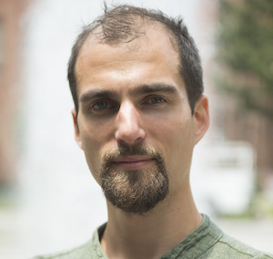

# Facilitators

[Deborah Khider](https://www.isi.edu/directory/dkhider/), Information Sciences Institute, University of Southern California

---

[Nick McKay](https://directory.nau.edu/person/npm4), School of Earth and Sustainability, Northern Arizona University

---

[David Edge](https://directory.nau.edu/departments?id=10228&person=dce25), School of Earth and Sustainability, Northern Arizona University

---

[Julien Emile-Geay](https://dornsife.usc.edu/profile/julien-emile-geay/), Department of Earth Sciences, University of Southern California

