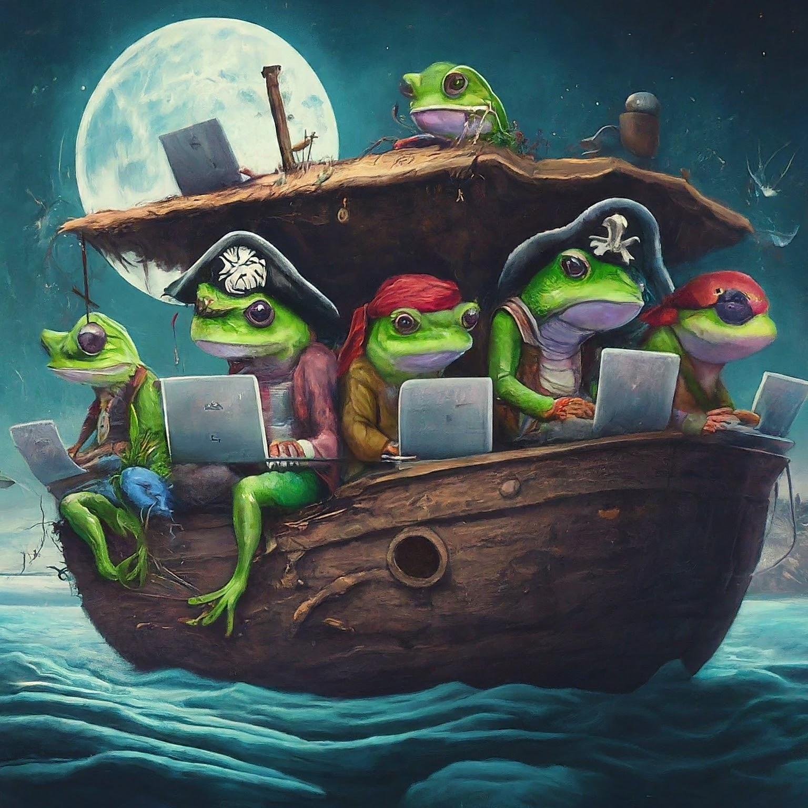
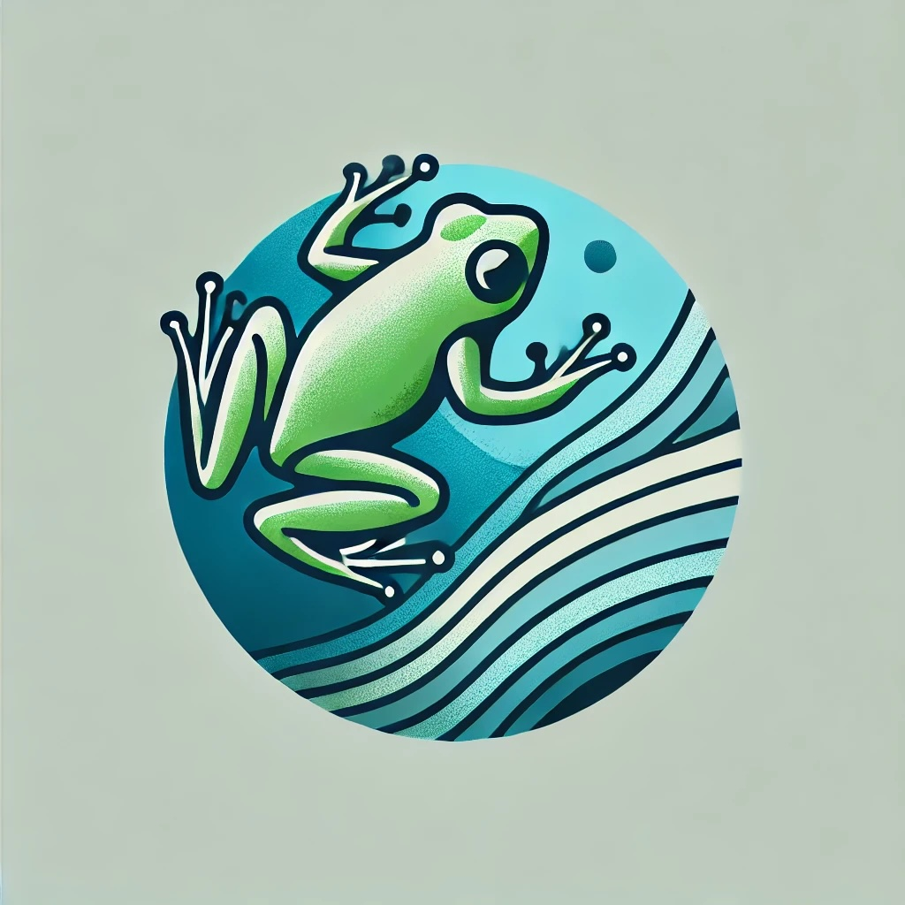
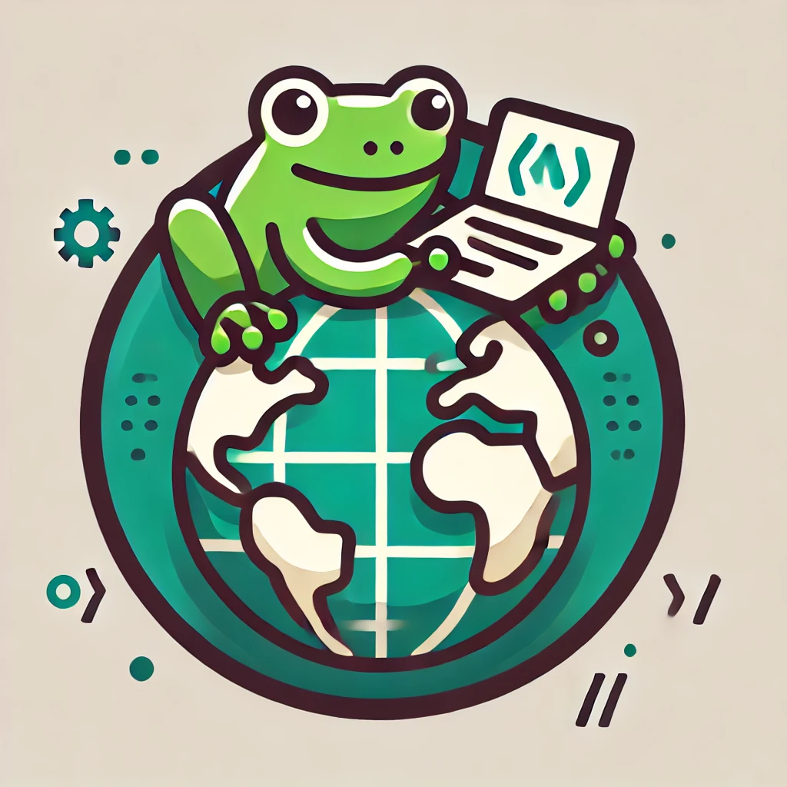

# Past workshops

Quick links:
- [PyRATES: Python and R Analysis of Time SerieS](#pyrates)
- [FAIRLeap: FAIR publishing in the geosciences](#fairleap)
- [Open Geoscience Hackathon](#ogh)

<h2 id="pyrates">PyRATES: Python and R Analysis of Time SerieS</h2>

## June 3-6, 2024, Marina Del Rey, CA

This workshop focused on foundational training in Python and R for the geosciences, with an emphasis on time series analysis. 

* *Intended audience:* researchers with no to little experience in Python, R, and their associated science and publishing ecosystems. 
* *Learning objectives:* basics of scientific Python and/or R; use of open source geoscience software in research; statistical concepts in time series analysis; FAIR science publishing; optional: paleoclimate data acumen. 
* *Description:* The workshop consisted of a blend of lectures and directed homework.
* *Completion:* Submission of a publically-available Jupyter Notebook (or R markdown) on GitHub reproducing a study (or part thereof) in their field, published according to FAIR principles. 

### Outcome

Note that some of these repositories are kept private, awaiting for publication. To view the notebooks, we suggest the use of [nbviewer](https://nbviewer.org).  

|Participant Name | Affiliation | Research Area | Repository |
|Pranay Tirpude | University of Delaware | Paleoceanography and Paleoclimatology | [GitHub](https://github.com/PaleoPranay/pyRATES)|
|Ruixia Bai | University of California-Santa Barbara|Volcanology, Geochemistry, and Petrology |[GitHub](https://github.com/ruixiabai/XYplot)|
|Kathryn Chen |Scripps Institution of Oceanography|Ocean Sciences|[GitHub](https://github.com/ksc005/pyrates/)|
|Dewan Haque|Louisiana State University|Earth and Planetary Surface Processes|[GitHub](https://github.com/Dewan-cpu/Decoding-Landslide-Hazard-Assessment)|
|Natalie Teale | Miami University | Hydrology | [GitHub](https://github.com/nteale/pyrates-proj)|
|Vasu Sreedevi | Florida Institute of Technology | Atmospheric Sciences | [GitHub](https://github.com/sputhiyamadam/PYRATES_workshop)|
|Jeng Hann Chong | University of New Mexico | Geodesy | [GitHub](https://github.com/chongjh11/pyrates2024)|
|Wenjia Li | University of Idaho | Geoinformatics | [GitHub](https://github.com/IGCCP/mindat-locality)|
|Victor Olawoyin | Boston College | Seismology | [GitHub](https://github.com/vikkybass/PyRates-reproduc) |
|Somita Chaudhari | University of Maryland Baltimore | Geoinformatics | [GitHub](https://github.com/SomitaChaudhari/Hawaii-Tidal-Analysis-Modelling-PyRates)|

### Workshop schedule

#### Day 1: Getting started (9am - 6pm)

| Start | End | Session | Speaker |
|9:00|10:00| Icebreaker, Overview of of FROGS and PyRATES, the LeapFROGS platform | Deborah Khider |
|10:00|11:00| Reproducible Research: What is it, why is it important and how do we do it? | Deborah Khider |  
|11:00|11:30| Working through a reproducible example: the HadCRUT5 data | All |   
|11:30|12:00| BREAK | --------- | 
|12:00|12:30| Reproducing a study in your field: getting started | All |
|12:30|13:00| Reproducing a study in your field: getting started - Peer-to-peer feedback | All |
|13:00|14:00| LUNCH | On your own | 
|14:00|16:00| Intro to Python or R | Deborah Khider, David Edge, Julien Emile-Geay, Nick McKay| 
|16:00|16:30| BREAK |---------| 
|16:30|17:30| Working Groups: Lightning Talks |Deborah Khider, David Edge, Julien Emile-Geay, Nick McKay| 
|17:30|18:00| Plenary debrief |all| 

#### Day 2: Building Up (9am - 6pm)

| Start | End | Session | Speaker |
|9:00|11:00| Intro to Python or R/ Get started on your reproducibility study | Deborah Khider, David Edge, Julien Emile-Geay, Nick McKay| 
|11:00|11:30| BREAK | --------- | 
|11:30|13:00| Concepts in data and software publishing | Deborah Khider| 
|13:00|14:00| LUNCH | On your own | 
|14:00|15:30| GitHub for software publishing and collaboration | Deborah Khider| 
|15:30|16:30| BREAK |---------| 
|16:30|18:00| Concepts in timeseries analysis and data processing |Julien Emile-Geay, NickMcKay| 

#### Day 3: Roaring the Engine (9am - 6pm)

| Start | End | Session | Speaker |
|9:00|10:30|Measures of Association: correlation, regression, degrees of freedom| Julien Emile-Geay, Nick McKay|
|10:30|11:30| BREAK | --------- | 
|11:30|13:00| Significance and Surrogates | Julien Emile-Geay, NickMcKay|
|13:00|14:00| LUNCH | On your own | 
|14:00|15:30| Spectral and Wavelet Analysis | Julien Emile-Geay, David Edge|  
|15:30|16:30| BREAK |---------| 
|16:30|18:00| Publishing Reproducible Workflows |Deborah Khider| 

#### Day 4: Fireworks (9am - 12pm)

| Start | End | Session | Speaker |
|9:00|10:30|Preparing to publish your reproducibility study| All |
|10:30|11:00| BREAK | --------- | 
|11:00|12:00| Citing data and software in your publications | Deborah Khider | 
|12:00|12:15| BREAK | --------- |
|12:15|13:00| Wrap-up | All |

<h2 id="fairleap">FAIRLeap: FAIR publishing in the geosciences</h2>

## February 11-14, 2025, Virtual, Anywhere on Earth

This workshop focused on publishing all artifacts of research in a manner consistent with FAIR principles to ensure that science is reproducible.

* *Intended audience:* researchers already engaged in geoscience research. Participants will be required to have worked through a geoscience project, either as part of a class project, a reproducibility study, or for a manuscript of their own. For manuscripts still *in preparation*, you must be ready to submit within seven weeks of the workshop. 
* *Learning objectives:* Introduction to FAIR science publishing;  basics of GitHub for software and project management; use of *Docker*, *Binder*, and *myBinder* for the sharing of reproducible workflows. 
* *Description:* The workshop will consist of a blend of lectures and directed homework in the morning synchronous sessions that will be held on Zoom. All lectures will be recorded and made available through YouTube for asynchronous learning. Asynchronous sessions, coordinated through Slack, will be reserved for participants' own research needs. Participants will be expected to present the outcome of the workshop on the last day
* *Completion:* Participants will be asked to submit their study following FAIR principles, with the workflow executable through myBinder and shared in a publicly-available science gallery.

### Outcome
Note that some of these repositories are kept private, awaiting for publication. To view the notebooks, we suggest the use of [nbviewer](https://nbviewer.org).

|Participant Name | Affiliation | Research Area | Repository |
|Kurt Lindberg | University at Buffalo | Paleoceanography and Paleoclimatology | [GitHub](https://github.com/kurtlindberg/qpt_mixsiar)|
|Marion Dugue | ETH Zurich |Planetary Science|[GitHub](https://github.com/MarionDugue/FAIR_practice/tree/main)|

### Schedule

#### Day 1: Introduction to FAIR Science Publishing

| Start | End | Session | Speaker |
|9:00|10:00| Icebreaker, Overview of FROGS and FAIRLeap, the LeapFROGS platform | David Edge |
|10:00|10:30| Reproducible Research: What is it, why is it important and how do we do it? | Deborah Khider |  
|10:30|11:00| Concepts in software and data publishing  | Deborah Khider |   
|11:00|11:30| Publishing reproducible workflows  | Deborah Khider | 
|11:30|12:00| Citing data/software and getting started with open science | Deborah Khider |
|12:00|13:00| LUNCH | ---------- |
|13:00|17:00| Asynchronous work session | All | 

#### Day 2: Basics of GitHub for software and project management

| Start | End | Session | Speaker |
|9:00|9:30| Summary from Day 1 - Reproducibility | Deborah Khider |
|9:30|10:00| What is Git? What is GitHub? | David Edge |
|9:30|12:00| Live GitHub tour - creating a repository, branches, pull request, GitHub for project management, obtaining a DOI for your software| Deborah Khider (Python) & David Edge (R) |  
|12:00|13:00| LUNCH | ---------- |
|13:00|17:00| Asynchronous work session | All | 

#### Day 3: Sharing reproducible workflows

Topics to be covered: Docker, Binder and myBinder, creating an environment or requirements file, GitHub actions, sharing your Docker container

| Start | End | Session | Speaker |
|9:00|9:30| Summary from Day 2 - Setting up a GitHub repository | Deborah Khider |
|9:30|10:00| What are containers? Introduction to Docker and myBinder | David Edge & Deborah Khider|
|10:00|12:00| Live container demo - creating a Docker container from your GitHub repository using GitHub actions and releasing notebooks on myBinder| Deborah Khider (Python) & David Edge (R) |  
|12:00|13:00| LUNCH | ---------- |
|13:00|17:00| Asynchronous work session | All | 

#### Day 4: Fireworks 

| Start | End | Session | Speaker |
|9:00|12:00| Presentations| All |
|12:00|13:00| LUNCH | ---------- |
|13:00|17:00| Review of a colleague's work - opening issues on GitHub | All |

<h2 id="ogh">Open Geoscience Hackathon</h2>

This workshop focused on packaging research software for the geosciences.

* *Intended audience*: Researchers interested in sharing their open science code in the form of an open source package, or in contributing to open source libraries.
* *Learning objectives*: opening pull requests to contribute to open source projects; packaging software for distribution, including documentation; principles of unit tests and continuous integration (CI); publishing through a package manager.
* *Description:* The workshop will consist of a blend of lectures and the participant's own research needs.
* *Completion:* Participants will be asked to submit a research software package to a repository such as CRAN or PyPI and/or contribute to an open source package through a pull request.

### Outcome
Note that some of these repositories are kept private, awaiting for publication. 

|Participant Name | Affiliation | Research Area | Repository |
|Kurt Lindberg | University at Buffalo | Paleoceanography and Paleoclimatology | [GitHub](https://github.com/kurtlindberg/leafwaxtools)|
|Duyi Li | University of Texas at Austin, Institute for Geophysics |Cryosphere Sciences|[GitHub](https://github.com/Duyi-Li/multipol)|
|Jean Costello | Boston University |GeoHealth|[GitHub](https://github.com/jeanmico/structuralnoisebarriers)|
|Preetika Kaur|University of Wyoming|Hydrology|[GitHub](https://github.com/preetika11)|
|Tanaya Gondhalekar|University of Southern California|Paleoceanography and Paleoclimatology|[GitHub](https://github.com/tanaya-g/sedproxy_python)|
|Surabhi Upadhyay|Colorado School of Mines|Hydrology|[GitHub](https://github.com/surabhiupadhyay/pyclimproj)|
|Juan S. Acero Triana|UCR/ENSC|Hydrology|[GitHub](https://github.com/jsacerot/Rpftools)|
|Nelofar Qulizada|University of Arkansas|Science and Society|[GitHub](https://github.com/nqulizada835/geocleaner)|
|Lindsay Fitzpatrick|University of Michigan|Earth and Planetary Surface Processes|[GitHub](https://github.com/lefitzpatrick/nbspredictor)|
|Bo Dong|Lawrence Livermore National Laboratory|Atmospheric Sciences|[GitHub](https://github.com/bosup/toy_package)|
|Zach Uhlmann|McMillen, Inc.|Geoinformatics|[GitHub](https://github.com/PratyushTripathy/pyrsgis)|

### Schedule

#### Day 1: Basics

| Start | End | Session        | Speaker       |
|-------|-----|----------------|----------------|
| 09:00 | 09:15 | Welcome | Deborah Khider |
| 09:15 | 10:30 | Basics of Packaging | Nick McKay|
| 10:30 | 10:45 | BREAK |--------|
| 10:45 | 12:00 | Hands-on practice with toy package| Deborah Khider|
| 12:00 | 13:00 | LUNCH |--------|
| 13:00 | 17:00 | Work on project     |--------|

#### Day 2: Documentation and testing

| Start | End | Session        | Speaker       |
|-------|-----|----------------|----------------|
| 09:00 | 10:00 | Writing a good documentation and testing| Nick McKay |
| 10:00 | 10:15 | BREAK |--------|
| 10:15 | 12:00 | Hands-on practice with toy package| Deborah Khider|
| 12:00 | 13:00 | LUNCH |--------|
| 13:00 | 17:00 | Work on project     |--------|

#### Day 3: Continuous integration and publishing your package

| Start | End | Session        | Speaker       |
|-------|-----|----------------|----------------|
| 09:00 | 10:00 | CI and publishing | Nick McKay |
| 10:00 | 10:15 | BREAK |--------|
| 10:15 | 12:00 | Hands-on practice with toy package| Deborah Khider|
| 12:00 | 13:00 | LUNCH     |--------|
| 13:00 | 17:00 | Work on project     |--------|
